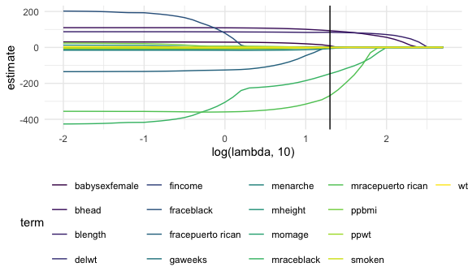
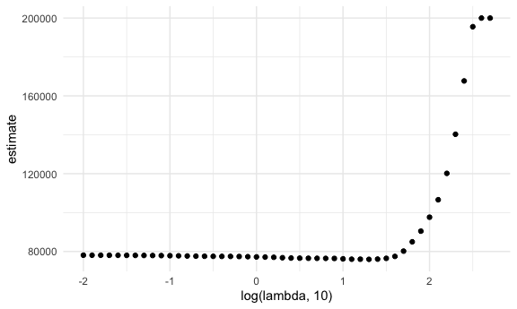
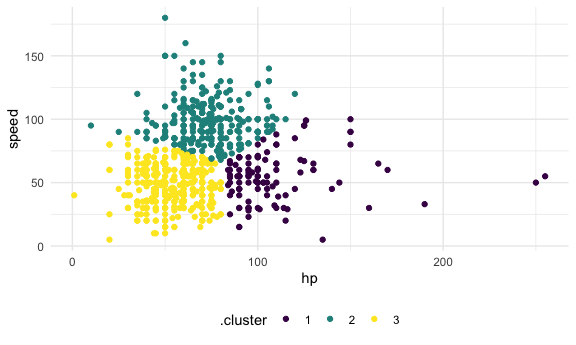

statistical_learning
================
Nicole Criscuolo
2025-11-20

## Do Lasso

``` r
bwt_df = 
  read_csv("data/birthweight.csv") |> 
  janitor::clean_names() |>
  mutate(
    babysex = 
        case_match(babysex,
            1 ~ "male",
            2 ~ "female"
        ),
    babysex = fct_infreq(babysex),
    frace = 
        case_match(frace,
            1 ~ "white",
            2 ~ "black", 
            3 ~ "asian", 
            4 ~ "puerto rican", 
            8 ~ "other"),
    frace = fct_infreq(frace),
    mrace = 
        case_match(mrace,
            1 ~ "white",
            2 ~ "black", 
            3 ~ "asian", 
            4 ~ "puerto rican",
            8 ~ "other"),
    mrace = fct_infreq(mrace),
    malform = as.logical(malform)) |> 
  sample_n(100)
```

    ## Rows: 4342 Columns: 20
    ## ── Column specification ────────────────────────────────────────────────────────
    ## Delimiter: ","
    ## dbl (20): babysex, bhead, blength, bwt, delwt, fincome, frace, gaweeks, malf...
    ## 
    ## ℹ Use `spec()` to retrieve the full column specification for this data.
    ## ℹ Specify the column types or set `show_col_types = FALSE` to quiet this message.

Need to do some data processing.

``` r
x = model.matrix(bwt ~ ., bwt_df) [, -1]
y = bwt_df |> pull(bwt)
```

Define some lambdas and fit lasso for each.

``` r
lambda = 10^(seq(-2, 2.75, 0.1))

lasso_fit = 
  glmnet(x = x, y = y, lambda = lambda)

lasso_cv =
  cv.glmnet(x = x, y = y, lambda = lambda)

lambda_opt = lasso_cv[["lambda.min"]]
```

There’s a lot of stuff in these.

Plot 1:

``` r
lasso_fit |> 
  broom::tidy() |> 
  select(term, lambda, estimate) |> 
  complete(term, lambda, fill = list(estimate = 0)) |> 
  filter(term != "(Intercept)") |> 
  ggplot(aes(x = log(lambda, 10), y = estimate, group = term, color = term)) + 
  geom_line() +
  geom_vline(xintercept = log(lambda_opt, 10))
```



Plot 2:

``` r
lasso_cv |> 
  broom::tidy() |> 
  ggplot(aes(x = log(lambda, 10), y = estimate)) + # estimate is RMSE
  geom_point()
```



``` r
lasso_fit =
  glmnet(x = x, y = y, lambda = lambda_opt)

lasso_fit |> 
  broom::tidy()
```

    ## # A tibble: 11 × 5
    ##    term               step  estimate lambda dev.ratio
    ##    <chr>             <dbl>     <dbl>  <dbl>     <dbl>
    ##  1 (Intercept)           1 -4464.      20.0     0.717
    ##  2 babysexfemale         1     8.83    20.0     0.717
    ##  3 bhead                 1    92.9     20.0     0.717
    ##  4 blength               1    83.9     20.0     0.717
    ##  5 delwt                 1     2.89    20.0     0.717
    ##  6 fincome               1     0.726   20.0     0.717
    ##  7 menarche              1    -6.59    20.0     0.717
    ##  8 mraceblack            1  -147.      20.0     0.717
    ##  9 mracepuerto rican     1  -268.      20.0     0.717
    ## 10 smoken                1    -2.00    20.0     0.717
    ## 11 wtgain                1     0.505   20.0     0.717

Look at pokemon to do clustering.

``` r
pokemon_df = 
  read_csv("data/pokemon.csv") |> 
  janitor::clean_names() |> 
  select(hp, speed)
```

    ## Rows: 800 Columns: 13
    ## ── Column specification ────────────────────────────────────────────────────────
    ## Delimiter: ","
    ## chr (3): Name, Type 1, Type 2
    ## dbl (9): #, Total, HP, Attack, Defense, Sp. Atk, Sp. Def, Speed, Generation
    ## lgl (1): Legendary
    ## 
    ## ℹ Use `spec()` to retrieve the full column specification for this data.
    ## ℹ Specify the column types or set `show_col_types = FALSE` to quiet this message.

``` r
pokemon_df |> 
  ggplot(aes(x = hp, y = speed)) + 
  geom_point()
```


Fit kmeans clustering to this data.

``` r
kmeans_fit =
  kmeans(x = pokemon_df, centers = 3)
```

Use broom to get nice results.

``` r
pokemon_df =
  broom::augment(kmeans_fit, pokemon_df)
```

Look at results.

``` r
pokemon_df |> 
  ggplot(aes(x = hp, y = speed, color = .cluster)) + 
  geom_point()
```


